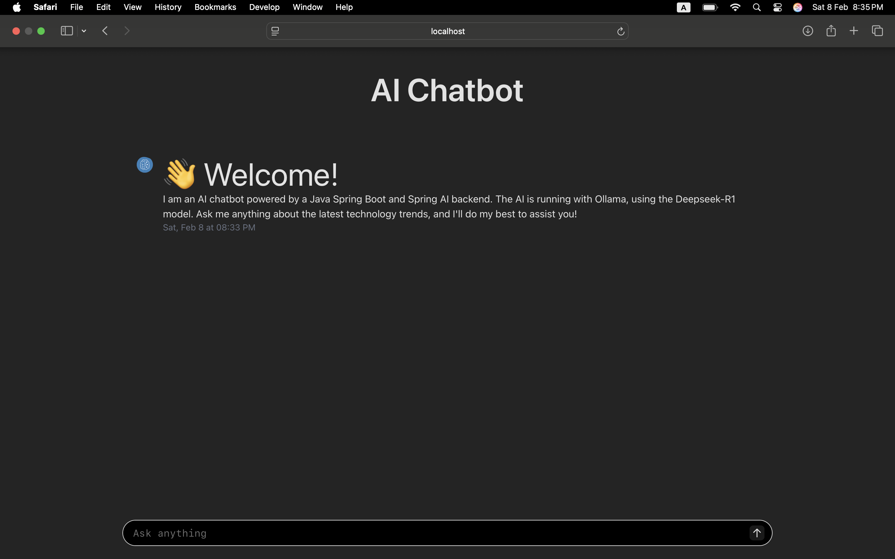

# Large Language Models (LLM)

## 🚀 LLM-Powered App with React, Vite, Spring Boot, and Spring AI  

This repository contains a **LLM-powered application** built with **React (Vite) for the frontend** and **Spring Boot with Spring AI** for the backend. It integrates **Ollama** and **DeepSeek-R1** to provide seamless AI-driven functionality. The project is designed for efficient, scalable, and high-performance AI interactions.  



## 🛠️ Tech Stack  
- **Frontend:** React + Vite ⚡  
- **Backend:** Spring Boot + Spring AI ☕  
- **LLM:** DeepSeek-R1 via Ollama 🤖  

## ✨ Features  
- Seamless AI model integration with **Spring AI**  
- Fast and responsive UI built with **Vite & React**  
- Local or cloud-based **LLM inference** using **DeepSeek-R1** and **Ollama**  
- Scalable and modular **Spring Boot API**  

## 🚀 Getting Started  

### Prerequisites  
Ensure you have the following installed:  
- Ollama installed and running  
- DeepSeek-R1 model available
- Java 17+    
- Node.js & npm

### Install and serve Ollama
Go to `https://ollama.com` and click download button, it'll redirect to download page `https://ollama.com/download`. Download based on your operating system and install it on your system.

Then go to `models` section, We can get all available models for ollama platform at `https://ollama.com/search`. Click on `deepseek-r1` section for an example. From dropdown select your desired tag. For an example of tag `1.5`. Then copy the run command, for an example `ollama run deepseek-r1:1.5b` replace **run** command with **pull** command and run it on your terminal.
```
ollama pull deepseek-r1:1.5b
```

Then run the following command to serve it with default port.
```
ollama serve
```
It should run on default port: `11434`

Note: For more configurations like serve as a remote server I'll show the steps later. Stay tuned!!!

### REST API Backend
I have created separate readme for backend development with Spring Boot. You can choose any other language or framework but basic mechanisms are simillar.
[Backend Development](https://github.com/rabbicse/llm/tree/master/backend)

### Create React project for frontend
I have created separate readme for frontend development with `react` and `vite`. You can choose any other framework but basic mechanisms are simillar.
[Frontend Development](https://github.com/rabbicse/llm/tree/master/frontend)

## References
- [https://ollama.com](https://ollama.com)
- [Spring Boot](https://spring.io/projects/spring-boot)
- [React](https://react.dev)
- [Vite](https://vite.dev)
- [Frontend Github Project](https://github.com/ruizguille/tech-trends-chatbot/tree/master/frontend)
