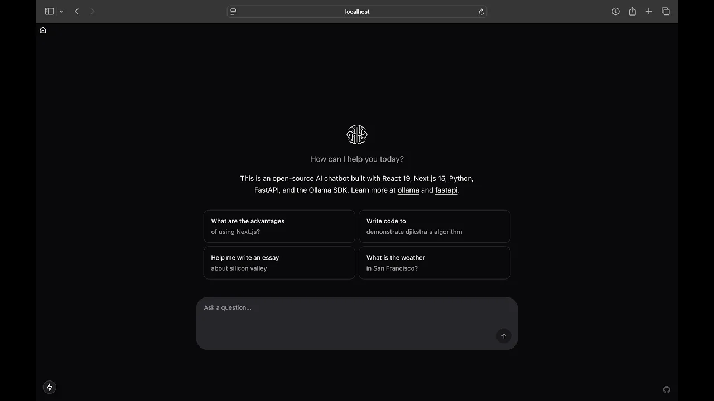

# AI Chatbot Frontend Development

## Introduction

Discover the power of AI chatbots and how they can revolutionize customer interactions, automate tasks, and enhance user experiences. Whether you're a developer, entrepreneur, or tech enthusiast, this ultimate guide will walk you through building and deploying AI-driven chatbots using cutting-edge technologies like Ollama, Deepseek-R1, Python, FastAPI, React, and Next.js.



## Core Technologies Used

- **Ollama & Deepseek-R1** – Advanced AI models for natural language processing (NLP) and conversational AI.
- **Python & FastAPI** – A lightweight and high-performance backend for building AI-driven chatbots.
- **React & Next.js** – A high-performance frontend framework for creating interactive and dynamic chatbot interfaces.

## Get Started Now!

By the end of this guide, you'll have the expertise to create AI-powered chatbots that offer intelligent and seamless user experiences. Dive in now and transform the way we interact with technology!

## Prerequisites

- React 19+
- Nextjs 15+
- Typescript

## Installation

Open your terminal and write the following command to get started.

```bash
npx create-next-app@latest
```

Follow the installation instructions like the following snippet.

```bash
❯ npx create-next-app@latest
Need to install the following packages:
create-next-app@15.1.7
Ok to proceed? (y) y

✔ What is your project named? … chatbot-client
✔ Would you like to use TypeScript? … No / Yes
✔ Would you like to use ESLint? … No / Yes
✔ Would you like to use Tailwind CSS? … No / Yes
✔ Would you like your code inside a `src/` directory? … No / Yes
✔ Would you like to use App Router? (recommended) … No / Yes
✔ Would you like to use Turbopack for `next dev`? … No / Yes
✔ Would you like to customize the import alias (`@/*` by default)? … No / Yes
Creating a new Next.js app in /Users/mehmet/Projects/github/llm/projects/chatbot/frontend/chatbot-client.

Using npm.

Initializing project with template: app-tw


Installing dependencies:
- react
- react-dom
- next

Installing devDependencies:
- typescript
- @types/node
- @types/react
- @types/react-dom
- postcss
- tailwindcss
- eslint
- eslint-config-next
- @eslint/eslintrc


added 377 packages, and audited 378 packages in 1m

144 packages are looking for funding
  run `npm fund` for details

found 0 vulnerabilities
Success! Created chatbot-client at /Users/mehmet/Projects/github/llm/projects/chatbot/frontend/chatbot-client

npm notice
npm notice New major version of npm available! 10.9.2 -> 11.1.0
npm notice Changelog: https://github.com/npm/cli/releases/tag/v11.1.0
npm notice To update run: npm install -g npm@11.1.0
npm notice
```

Then write the following command to go to the directory `ai-chatbot`

```shell
cd ai-chatbot
```

Then go to `https://ui.shadcn.com/docs/installation/next` to check the shadcn installation inside nextjs project.

1. Run the init command to create a new Next.js project or to setup an existing one:

```shell
npx shadcn@latest init
```

For React 19+ and Nextjs 15+ use the following command

```shell
npx shadcn@canary init
```

2. You will be asked a few questions to configure `components.json`:

```shell
❯ npx shadcn@latest init

Need to install the following packages:
shadcn@2.3.0
Ok to proceed? (y)

✔ Preflight checks.
✔ Verifying framework. Found Next.js.
✔ Validating Tailwind CSS.
✔ Validating import alias.
✔ Which style would you like to use? › New York
✔ Which color would you like to use as the base color? › Zinc
✔ Would you like to use CSS variables for theming? … no / yes
✔ Writing components.json.
✔ Checking registry.
✔ Updating tailwind.config.ts
✔ Updating src/app/globals.css
  Installing dependencies.

It looks like you are using React 19.
Some packages may fail to install due to peer dependency issues in npm (see https://ui.shadcn.com/react-19).

✔ How would you like to proceed? › Use --force
✔ Installing dependencies.
✔ Created 1 file:
  - src/lib/utils.ts

Success! Project initialization completed.
You may now add components.
```

For React 19 and Nextjs 15+
```shell
❯ npx shadcn@canary init
✔ Preflight checks.
✔ Verifying framework. Found Next.js.
✔ Validating Tailwind CSS.
✔ Validating import alias.
√ Which style would you like to use? » New York (Recommended)
√ Which color would you like to use as the base color? » Zinc
√ Would you like to use CSS variables for theming? ... no / yes
✔ Writing components.json.
✔ Checking registry.
✔ Updating tailwind.config.ts
✔ Updating src\app\globals.css
  Installing dependencies.

It looks like you are using React 19.
Some packages may fail to install due to peer dependency issues in npm (see https://ui.shadcn.com/react-19).

√ How would you like to proceed? » Use --legacy-peer-deps
✔ Installing dependencies.
✔ Created 1 file:
  - src\lib\utils.ts

Success! Project initialization completed.
You may now add components.
```

## Shadcn-ui
Add the following `shadcn-ui` mcomponents.
```shell
npx shadcn@latest add avatar
npx shadcn@latest add button
npx shadcn@latest add card
npx shadcn@latest add sonner
```

or, for React 19+ and Nextjs 15+ use the following commands.
```shell
npx shadcn@canary add avatar
npx shadcn@canary add button
npx shadcn@canary add card
npx shadcn@canary add sonner
```

### react-textarea-autosize
Install `react-textarea-autosize` by the following command.
```shell
npm install react-textarea-autosize
```

### next-themes
Install `next-themes` package by the following command.
```shell
npm install next-themes
```

### react-icons
Install `react-icons` package by the following command.
```shell
npm install react-icons
npm install @radix-ui/react-icons
```

### swr
Install `swr` package by the following command.
```shell
npm install swr
```

### framer-motion
Install `framer-motion` package for animation purpose by the following command.
```shell
npm install framer-motion
```

### marked
Install `marked` package to visualize messages.
```shell
npm install marked
```

### react-code-blocks
Install `react-code-blocks` package to visualize code blocks.
```shell
npm install react-code-blocks
```

### @microsoft/fetch-event-source
Install `@microsoft/fetch-event-source` package to handle `event-streams` by the following command.
```shell
npm install @microsoft/fetch-event-source
```

## Implementation
### theme-privider.tsx
Add `theme-provider.tsx` under components directory with the following code block.
```typescript
'use client'

import * as React from 'react'
import { ThemeProvider as NextThemesProvider } from 'next-themes'
import { type ThemeProviderProps } from 'next-themes'

export function ThemeProvider({ children, ...props }: ThemeProviderProps) {
  return <NextThemesProvider {...props}>{children}</NextThemesProvider>
}
```

### utils.ts
Add the following function to generate unique ID under `lib/utils.ts`.
```typescript
export function generateUUID(): string {
  return "xxxxxxxx-xxxx-4xxx-yxxx-xxxxxxxxxxxx".replace(/[xy]/g, (c) => {
    const r = (Math.random() * 16) | 0;
    const v = c === "x" ? r : (r & 0x3) | 0x8;
    return v.toString(16);
  });
}
```

### icons component
Under `components/ui/icons.tsx` add the following code block.
```typescript
"use client";

import * as React from "react";
import { cn } from "@/lib/utils";

export const UserIcon = ({ size = 16 }) => {
  return (
    <svg
      data-testid="geist-icon"
      height={size}
      strokeLinejoin="round"
      viewBox="0 0 16 16"
      width={size}
      style={{ color: "currentcolor" }}
    >
      <path
        fillRule="evenodd"
        clipRule="evenodd"
        d="M7.75 0C5.95507 0 4.5 1.45507 4.5 3.25V3.75C4.5 5.54493 5.95507 7 7.75 7H8.25C10.0449 7 11.5 5.54493 11.5 3.75V3.25C11.5 1.45507 10.0449 0 8.25 0H7.75ZM6 3.25C6 2.2835 6.7835 1.5 7.75 1.5H8.25C9.2165 1.5 10 2.2835 10 3.25V3.75C10 4.7165 9.2165 5.5 8.25 5.5H7.75C6.7835 5.5 6 4.7165 6 3.75V3.25ZM2.5 14.5V13.1709C3.31958 11.5377 4.99308 10.5 6.82945 10.5H9.17055C11.0069 10.5 12.6804 11.5377 13.5 13.1709V14.5H2.5ZM6.82945 9C4.35483 9 2.10604 10.4388 1.06903 12.6857L1 12.8353V13V15.25V16H1.75H14.25H15V15.25V13V12.8353L14.931 12.6857C13.894 10.4388 11.6452 9 9.17055 9H6.82945Z"
        fill="currentColor"
      />
    </svg>
  );
};

export const OllamaIcon = ({ size = 16 }) => {
  return (
    <svg
      height={size}
      strokeLinejoin="round"
      viewBox="0 0 16 24"
      width={size}
      style={{ color: "currentcolor" }}
      xmlns="http://www.w3.org/2000/svg"
    >
      <path
        fillRule="evenodd"
        clipRule="evenodd"
        fill="currentColor"
        d="M16.361 10.26a.894.894 0 0 0-.558.47l-.072.148.001.207c0 .193.004.217.059.353.076.193.152.312.291.448.24.238.51.3.872.205a.86.86 0 0 0 .517-.436.752.752 0 0 0 .08-.498c-.064-.453-.33-.782-.724-.897a1.06 1.06 0 0 0-.466 0zm-9.203.005c-.305.096-.533.32-.65.639a1.187 1.187 0 0 0-.06.52c.057.309.31.59.598.667.362.095.632.033.872-.205.14-.136.215-.255.291-.448.055-.136.059-.16.059-.353l.001-.207-.072-.148a.894.894 0 0 0-.565-.472 1.02 1.02 0 0 0-.474.007Zm4.184 2c-.131.071-.223.25-.195.383.031.143.157.288.353.407.105.063.112.072.117.136.004.038-.01.146-.029.243-.02.094-.036.194-.036.222.002.074.07.195.143.253.064.052.076.054.255.059.164.005.198.001.264-.03.169-.082.212-.234.15-.525-.052-.243-.042-.28.087-.355.137-.08.281-.219.324-.314a.365.365 0 0 0-.175-.48.394.394 0 0 0-.181-.033c-.126 0-.207.03-.355.124l-.085.053-.053-.032c-.219-.13-.259-.145-.391-.143a.396.396 0 0 0-.193.032zm.39-2.195c-.373.036-.475.05-.654.086a4.48 4.48 0 0 0-.951.328c-.94.46-1.589 1.226-1.787 2.114-.04.176-.045.234-.045.53 0 .294.005.357.043.524.264 1.16 1.332 2.017 2.714 2.173.3.033 1.596.033 1.896 0 1.11-.125 2.064-.727 2.493-1.571.114-.226.169-.372.22-.602.039-.167.044-.23.044-.523 0-.297-.005-.355-.045-.531-.288-1.29-1.539-2.304-3.072-2.497a6.873 6.873 0 0 0-.855-.031zm.645.937a3.283 3.283 0 0 1 1.44.514c.223.148.537.458.671.662.166.251.26.508.303.82.02.143.01.251-.043.482-.08.345-.332.705-.672.957a3.115 3.115 0 0 1-.689.348c-.382.122-.632.144-1.525.138-.582-.006-.686-.01-.853-.042-.57-.107-1.022-.334-1.35-.68-.264-.28-.385-.535-.45-.946-.03-.192.025-.509.137-.776.136-.326.488-.73.836-.963.403-.269.934-.46 1.422-.512.187-.02.586-.02.773-.002zm-5.503-11a1.653 1.653 0 0 0-.683.298C5.617.74 5.173 1.666 4.985 2.819c-.07.436-.119 1.04-.119 1.503 0 .544.064 1.24.155 1.721.02.107.031.202.023.208a8.12 8.12 0 0 1-.187.152 5.324 5.324 0 0 0-.949 1.02 5.49 5.49 0 0 0-.94 2.339 6.625 6.625 0 0 0-.023 1.357c.091.78.325 1.438.727 2.04l.13.195-.037.064c-.269.452-.498 1.105-.605 1.732-.084.496-.095.629-.095 1.294 0 .67.009.803.088 1.266.095.555.288 1.143.503 1.534.071.128.243.393.264.407.007.003-.014.067-.046.141a7.405 7.405 0 0 0-.548 1.873 5.2 5.2 0 0 0-.071.991c0 .56.031.832.148 1.279L3.42 24h1.478l-.05-.091c-.297-.552-.325-1.575-.068-2.597.117-.472.25-.819.498-1.296l.148-.29v-.177c0-.165-.003-.184-.057-.293a.915.915 0 0 0-.194-.25 1.74 1.74 0 0 1-.385-.543c-.424-.92-.506-2.286-.208-3.451.124-.486.329-.918.544-1.154a.787.787 0 0 0 .223-.531c0-.195-.07-.355-.224-.522a3.136 3.136 0 0 1-.817-1.729c-.14-.96.114-2.005.69-2.834.563-.814 1.353-1.336 2.237-1.475.199-.033.57-.028.776.01.226.04.367.028.512-.041.179-.085.268-.19.374-.431.093-.215.165-.333.36-.576.234-.29.46-.489.822-.729.413-.27.884-.467 1.352-.561.17-.035.25-.04.569-.04.319 0 .398.005.569.04a4.07 4.07 0 0 1 1.914.997c.117.109.398.457.488.602.034.057.095.177.132.267.105.241.195.346.374.43.14.068.286.082.503.045.343-.058.607-.053.943.016 1.144.23 2.14 1.173 2.581 2.437.385 1.108.276 2.267-.296 3.153-.097.15-.193.27-.333.419-.301.322-.301.722-.001 1.053.493.539.801 1.866.708 3.036-.062.772-.26 1.463-.533 1.854a2.096 2.096 0 0 1-.224.258.916.916 0 0 0-.194.25c-.054.109-.057.128-.057.293v.178l.148.29c.248.476.38.823.498 1.295.253 1.008.231 2.01-.059 2.581a.845.845 0 0 0-.044.098c0 .006.329.009.732.009h.73l.02-.074.036-.134c.019-.076.057-.3.088-.516a9.104 9.104 0 0 0 0-1.258c-.11-.875-.295-1.57-.597-2.226-.032-.074-.053-.138-.046-.141a1.42 1.42 0 0 0 .108-.152c.376-.569.607-1.284.724-2.228.031-.26.031-1.378 0-1.628-.083-.645-.182-1.082-.348-1.525a6.083 6.083 0 0 0-.329-.7l-.038-.064.131-.194c.402-.604.636-1.262.727-2.04a6.625 6.625 0 0 0-.024-1.358 5.512 5.512 0 0 0-.939-2.339 5.325 5.325 0 0 0-.95-1.02 8.097 8.097 0 0 1-.186-.152.692.692 0 0 1 .023-.208c.208-1.087.201-2.443-.017-3.503-.19-.924-.535-1.658-.98-2.082-.354-.338-.716-.482-1.15-.455-.996.059-1.8 1.205-2.116 3.01a6.805 6.805 0 0 0-.097.726c0 .036-.007.066-.015.066a.96.96 0 0 1-.149-.078A4.857 4.857 0 0 0 12 3.03c-.832 0-1.687.243-2.456.698a.958.958 0 0 1-.148.078c-.008 0-.015-.03-.015-.066a6.71 6.71 0 0 0-.097-.725C8.997 1.392 8.337.319 7.46.048a2.096 2.096 0 0 0-.585-.041Zm.293 1.402c.248.197.523.759.682 1.388.03.113.06.244.069.292.007.047.026.152.041.233.067.365.098.76.102 1.24l.002.475-.12.175-.118.178h-.278c-.324 0-.646.041-.954.124l-.238.06c-.033.007-.038-.003-.057-.144a8.438 8.438 0 0 1 .016-2.323c.124-.788.413-1.501.696-1.711.067-.05.079-.049.157.013zm9.825-.012c.17.126.358.46.498.888.28.854.36 2.028.212 3.145-.019.14-.024.151-.057.144l-.238-.06a3.693 3.693 0 0 0-.954-.124h-.278l-.119-.178-.119-.175.002-.474c.004-.669.066-1.19.214-1.772.157-.623.434-1.185.68-1.382.078-.062.09-.063.159-.012z"
      />
    </svg>
  );
};

export const HomeIcon = ({ size = 16 }: { size: number }) => {
  return (
    <svg
      height={size}
      strokeLinejoin="round"
      viewBox="0 0 16 16"
      width={size}
      style={{ color: "currentcolor" }}
    >
      <path
        fillRule="evenodd"
        clipRule="evenodd"
        d="M12.5 6.56062L8.00001 2.06062L3.50001 6.56062V13.5L6.00001 13.5V11C6.00001 9.89539 6.89544 8.99996 8.00001 8.99996C9.10458 8.99996 10 9.89539 10 11V13.5L12.5 13.5V6.56062ZM13.78 5.71933L8.70711 0.646409C8.31659 0.255886 7.68342 0.255883 7.2929 0.646409L2.21987 5.71944C2.21974 5.71957 2.21961 5.7197 2.21949 5.71982L0.469676 7.46963L-0.0606537 7.99996L1.00001 9.06062L1.53034 8.53029L2.00001 8.06062V14.25V15H2.75001L6.00001 15H7.50001H8.50001H10L13.25 15H14V14.25V8.06062L14.4697 8.53029L15 9.06062L16.0607 7.99996L15.5303 7.46963L13.7806 5.71993C13.7804 5.71973 13.7802 5.71953 13.78 5.71933ZM8.50001 11V13.5H7.50001V11C7.50001 10.7238 7.72386 10.5 8.00001 10.5C8.27615 10.5 8.50001 10.7238 8.50001 11Z"
        fill="currentColor"
      />
    </svg>
  );
};

export const MessageIcon = ({ size = 16 }: { size?: number }) => {
  return (
    <svg
      height={size}
      strokeLinejoin="round"
      viewBox="0 0 16 16"
      width={size}
      style={{ color: "currentcolor" }}
    >
      <path
        fillRule="evenodd"
        clipRule="evenodd"
        d="M2.8914 10.4028L2.98327 10.6318C3.22909 11.2445 3.5 12.1045 3.5 13C3.5 13.3588 3.4564 13.7131 3.38773 14.0495C3.69637 13.9446 4.01409 13.8159 4.32918 13.6584C4.87888 13.3835 5.33961 13.0611 5.70994 12.7521L6.22471 12.3226L6.88809 12.4196C7.24851 12.4724 7.61994 12.5 8 12.5C11.7843 12.5 14.5 9.85569 14.5 7C14.5 4.14431 11.7843 1.5 8 1.5C4.21574 1.5 1.5 4.14431 1.5 7C1.5 8.18175 1.94229 9.29322 2.73103 10.2153L2.8914 10.4028ZM2.8135 15.7653C1.76096 16 1 16 1 16C1 16 1.43322 15.3097 1.72937 14.4367C1.88317 13.9834 2 13.4808 2 13C2 12.3826 1.80733 11.7292 1.59114 11.1903C0.591845 10.0221 0 8.57152 0 7C0 3.13401 3.58172 0 8 0C12.4183 0 16 3.13401 16 7C16 10.866 12.4183 14 8 14C7.54721 14 7.10321 13.9671 6.67094 13.9038C6.22579 14.2753 5.66881 14.6656 5 15C4.23366 15.3832 3.46733 15.6195 2.8135 15.7653Z"
        fill="currentColor"
      />
    </svg>
  );
};

export const AILogo = ({
  className,
  ...props
}: React.ComponentProps<"svg">) => (
  <svg
    fill="currentColor"
    xmlns="http://www.w3.org/2000/svg"
    xmlSpace="preserve"
    viewBox="0 0 32 32"
    className={className}
    {...props}
  >
    <path d="M12 1.64h-.006c-1.473 0-2.691.759-3.239 2h-.489c-1.271 0-2.478.425-3.398 1.199-.976.82-1.514 1.951-1.516 3.182-.001.995.526 2.097 1.025 2.791C2.154 11.582.643 13.445.64 15.5c-.003 2.046 1.507 3.91 3.734 4.687-.506.692-1.044 1.788-1.045 2.766-.003 2.426 2.215 4.403 4.947 4.408h.48c.543 1.238 1.764 1.998 3.244 2h.007c1.972 0 3.351-1.381 3.354-3.36V5c.002-1.975-1.379-3.357-3.361-3.36zm0 17a.64.64 0 1 1 .001-1.281A.64.64 0 0 1 12 18.64zm2.64-5h-2.28V7.305c.575-.159 1-.681 1-1.305 0-.75-.61-1.36-1.36-1.36s-1.36.61-1.36 1.36c0 .625.425 1.146 1 1.305v6.335H9.998c-.798 0-1.357.559-1.358 1.36v.64H6.305c-.159-.575-.681-1-1.305-1-.75 0-1.36.61-1.36 1.36s.61 1.36 1.36 1.36c.625 0 1.147-.426 1.305-1H8.64v5.834c-.575.159-1 .681-1 1.306 0 .75.61 1.36 1.36 1.36s1.36-.61 1.36-1.36c0-.625-.425-1.147-1-1.306V15c.001-.401.239-.641.639-.641h4.641v11.639c-.003 1.456-.908 2.46-2.28 2.61v-9.303c.575-.159 1-.681 1-1.306 0-.75-.61-1.36-1.36-1.36s-1.36.61-1.36 1.36c0 .625.425 1.147 1 1.306v9.31c-1.103-.114-1.951-.742-2.3-1.735a.36.36 0 0 0-.34-.24h-.724c-2.036-.003-4.23-1.413-4.228-3.686.002-.966.714-2.209 1.206-2.699a.36.36 0 0 0-.164-.604c-2.199-.566-3.733-2.273-3.73-4.151.003-1.876 1.522-3.573 3.695-4.141h2.64c.159.575.681 1 1.305 1A1.36 1.36 0 0 0 9 9.64c-.625 0-1.146.425-1.305 1H5.162c-.477-.541-1.092-1.691-1.091-2.618.002-1.016.449-1.95 1.261-2.632.779-.655 1.849-1.03 2.936-1.03H9a.36.36 0 0 0 .339-.239c.392-1.103 1.384-1.761 2.655-1.761h.005c1.583.003 2.644 1.063 2.641 2.64v8.64zm-2.64-7a.64.64 0 1 1 .001-1.281A.64.64 0 0 1 12 6.64zM9 22.86a.64.64 0 1 1-.001 1.281A.64.64 0 0 1 9 22.86zM5.64 16a.64.64 0 1 1-1.281-.001A.64.64 0 0 1 5.64 16zm2.72-5a.64.64 0 1 1 1.281.001A.64.64 0 0 1 8.36 11zm23 4.5c.002-2.046-1.508-3.909-3.734-4.687.507-.692 1.044-1.788 1.046-2.767.002-1.231-.54-2.365-1.526-3.193-.917-.77-2.163-1.212-3.421-1.214h-.48c-.544-1.238-1.764-1.998-3.243-2h-.008c-.972 0-1.808.323-2.418.933-.611.613-.934 1.451-.936 2.428v20.999c-.003 1.976 1.378 3.357 3.359 3.361h.007c1.473 0 2.69-.76 3.238-2h.489c1.271 0 2.478-.426 3.398-1.199.977-.82 1.515-1.95 1.517-3.182.001-.995-.526-2.098-1.025-2.791 2.224-.77 3.734-2.633 3.737-4.688zM20 12.36a.64.64 0 1 1-.001 1.281A.64.64 0 0 1 20 12.36zm6.946 7.28h-2.641c-.159-.575-.681-1-1.306-1-.75 0-1.36.61-1.36 1.36s.61 1.36 1.36 1.36c.624 0 1.147-.425 1.306-1h2.533c.476.541 1.091 1.691 1.089 2.618-.001 1.016-.448 1.95-1.26 2.631-.781.657-1.865 1.01-2.943 1.03H23a.362.362 0 0 0-.339.239c-.393 1.104-1.385 1.761-2.655 1.761h-.005c-.781-.001-1.445-.252-1.919-.725S17.358 26.78 17.36 26v-8.64h2.279v6.334c-.575.159-1 .681-1 1.306 0 .75.61 1.36 1.36 1.36s1.36-.61 1.36-1.36c0-.624-.425-1.147-1-1.306V17.36h1.642c.799 0 1.356-.559 1.358-1.36v-.64h2.334c.159.575.681 1 1.306 1 .75 0 1.36-.61 1.36-1.36s-.61-1.36-1.36-1.36c-.625 0-1.147.425-1.306 1H23.36V8.805c.575-.159 1-.681 1-1.305 0-.75-.61-1.36-1.36-1.36s-1.36.61-1.36 1.36c0 .624.425 1.146 1 1.305V16c0 .401-.238.641-.638.641H17.36V5c.001-.781.252-1.445.725-1.918.397-.398.933-.627 1.555-.693v9.305c-.575.159-1 .681-1 1.305 0 .75.61 1.36 1.36 1.36s1.36-.61 1.36-1.36c0-.624-.425-1.146-1-1.305v-9.31c1.103.115 1.951.742 2.3 1.736.051.144.188.24.34.24h.724c1.092.001 2.17.383 2.959 1.045.82.689 1.271 1.626 1.269 2.641-.001.966-.714 2.209-1.205 2.699a.36.36 0 0 0 .164.604c2.198.567 3.732 2.274 3.729 4.151-.002 1.874-1.52 3.57-3.694 4.14zM23.64 20a.64.64 0 1 1-1.281-.001.64.64 0 0 1 1.281.001zM20 24.36a.64.64 0 1 1-.001 1.281A.64.64 0 0 1 20 24.36zm3-16.22a.64.64 0 1 1 .001-1.281A.64.64 0 0 1 23 8.14zM26.36 15a.64.64 0 1 1 1.281.001A.64.64 0 0 1 26.36 15z" />
    <path
      d="M0 0h32v32H0z"
      style={{
        fill: "none",
      }}
    />
  </svg>
);
```

### header
Add header component under `components/header.tsx` with the following code block.
```typescript
'use client'

import React from 'react'
import { HomeIcon } from 'lucide-react'
import Link from 'next/link'

export const Header: React.FC = () => {
  return (
    <header className="fixed w-full p-2 flex justify-between items-center z-10 backdrop-blur md:backdrop-blur-none bg-background/80 md:bg-transparent">
      <div>
        <Link href="/">
          <HomeIcon size={16} />
          <span className="sr-only">Mehedi</span>
        </Link>
      </div>
    </header>
  )
}

export default Header
```

### footer
Under `components/footer.tsx` write the following code block.
```typescript
'use client'

import Link from 'next/link'
import React from 'react'
import { SiDiscord, SiGithub, SiX } from 'react-icons/si'
import { Button } from './ui/button'

const Footer: React.FC = () => {
  return (
    <footer className="w-fit p-1 md:p-2 fixed bottom-0 right-0 hidden lg:block">
      <div className="flex justify-end">
        <Button
          variant={'ghost'}
          size={'icon'}
          className="text-muted-foreground/50"
        >
          <Link href="https://github.com/rabbicse" target="_blank">
            <SiGithub size={18} />
          </Link>
        </Button>
      </div>
    </footer>
  )
}

export default Footer
```

### interfaces
Add the following code under `src/lib/types.ts`
```typescript
/**
 * AI SDK UI Messages. They are used in the client and to communicate between the frontend and the API routes.
 */
export interface Message {
  /**
    A unique identifier for the message.
     */
  id: string;

  /**
    The timestamp of the message.
     */
  createdAt?: Date;

  /**
    Text content of the message. Use parts when possible.
     */
  content: string;

  /**
    The 'data' role is deprecated.
     */
  role: "system" | "user" | "assistant";

  /**
   * The parts of the message. Use this for rendering the message in the UI.
   *
   * Assistant messages can have text, reasoning and tool invocation parts.
   * User messages can have text parts.
   */
  // note: optional on the Message type (which serves as input)
  parts?: Array<TextUIPart>;
}

/**
 * A text part of a message.
 */
export type TextUIPart = {
  type: "text";

  /**
   * The text content.
   */
  text: string;
};
```

Then update the `utils.ts` by the following code block.
```typescript
export function fillMessageParts(messages: Message[]): Message[] {
  return messages.map(message => ({
    ...message,
    parts: getMessageParts(message),
  }));
}

export function getMessageParts(message: Message): (TextUIPart)[] {
  return (
    message.parts ?? [
      ...(message.content
        ? [{ type: 'text' as const, text: message.content }]
        : []),
    ]
  );
}
```

### chat
Create `chat` component under `components/chat.tsx` and add the following code block.
```typescript
"use client";

export function Chat({
    id
}: {
    id: string
}) {
    return (
        <div className="flex flex-col w-full max-w-3xl pt-14 pb-60 mx-auto stretch">
            <h1>Welcome To AI Chat!</h1>
            <p> Chat ID: {id}</p>
        </div>
    );
}
```

### Main Page
update `src/app/page.tsx` with the following code block.
```typescript
import { Chat } from "@/components/chat";
import { generateUUID } from "@/lib/utils";

export default function Home() {
  const id = generateUUID();
  return <Chat id={id} />;
}
```

### layout.tsx
Update the `src/app/layout.tsx` with the following code block.
```typescript
import type { Metadata, Viewport } from "next";
import { Inter as FontSans } from "next/font/google";
import "./globals.css";
import { ThemeProvider } from "@/components/providers/theme-provider";
import Header from "@/components/header";
import { cn } from "@/lib/utils";
import Footer from "@/components/footer";
import { Toaster } from "@/components/ui/sonner";

const fontSans = FontSans({
  subsets: ['latin'],
  variable: '--font-sans'
})

const title = 'AI Chtbot'
const description =
  'A fully open-source AI-powered chatbot with a generative UI.'

export const metadata: Metadata = {
  metadataBase: new URL('http://rabbi.work'),
  title,
  description,
  openGraph: {
    title,
    description
  }
}

export const viewport: Viewport = {
  width: 'device-width',
  initialScale: 1,
  minimumScale: 1,
  maximumScale: 1
}


export default function RootLayout({
  children,
}: Readonly<{
  children: React.ReactNode;
}>) {
  return (
    <html lang="en"
      // `next-themes` injects an extra classname to the body element to avoid
      // visual flicker before hydration. Hence the `suppressHydrationWarning`
      // prop is necessary to avoid the React hydration mismatch warning.
      // https://github.com/pacocoursey/next-themes?tab=readme-ov-file#with-app
      suppressHydrationWarning
    >
      <body className={cn('font-sans antialiased', fontSans.variable)}>
        <ThemeProvider
          attribute="class"
          defaultTheme="dark"
          enableSystem
          disableTransitionOnChange
        >
          <Header />
          {children}
          <Footer />
          <Toaster />
        </ThemeProvider>
      </body>
    </html>
  );
}
```

Now run the following command to run the application. 
```shell
npm run dev
```

Then visit `http://localhost:3000` to show basic application.

Now it's time to develop core functionalities!

## Core Implementation
### overview
Add `overview.tsx` component under `src/components` directory with the following code block.
```typescript
import { motion } from "framer-motion";
import Link from "next/link";

import { AILogo } from "@/components/ui/icons";

export const Overview = () => {
  return (
    <motion.div
      key="overview"
      className="max-w-3xl mx-auto md:mt-20"
      initial={{ opacity: 0, scale: 0.98 }}
      animate={{ opacity: 1, scale: 1 }}
      exit={{ opacity: 0, scale: 0.98 }}
      transition={{ delay: 0.5 }}
    >
      <div className="rounded-xl p-6 flex flex-col gap-4 leading-relaxed text-center max-w-xl">
        <p className="flex flex-row justify-center gap-4 items-center">
          <AILogo width={48} height={48} />
          {/* <span>+</span>
                    <MessageIcon size={48} /> */}
        </p>
        <p className="text-center text-lg text-muted-foreground gap-1">
          How can I help you today?
        </p>
        <p className="gap-1 items-center">
          This is an open-source AI chatbot built with React 19, Next.js 15,
          Python, FastAPI, and the Ollama SDK. Learn more at{" "}
          <Link
            className="font-medium underline underline-offset-4"
            href="https://ollama.com/"
            target="_blank"
          >
            ollama
          </Link>{" "}
          and{" "}
          <Link
            className="font-medium underline underline-offset-4"
            href="https://fastapi.tiangolo.com/"
            target="_blank"
          >
            fastapi
          </Link>
          .
        </p>
      </div>
    </motion.div>
  );
};
```

### suggested-actions
Add `suggested-actions.tsx` under `components` directory with the following code block. It'll provide question or query suggestions if no query entered at landing page.
```typescript
"use client";

import { motion } from "framer-motion";
import { Button } from "./ui/button";
import { memo } from "react";
import { Message } from "@/lib/types";
import { generateUUID } from "@/lib/utils";
import { Overview } from "./overview";

interface SuggestedActionsProps {
  chatId: string;
  appendAndTrigger: (message: Message) => Promise<void>;
}

function PureSuggestedActions({ chatId, appendAndTrigger }: SuggestedActionsProps) {
  const suggestedActions = [
    {
      title: "What are the advantages",
      label: "of using Next.js?",
      action: "What are the advantages of using Next.js?",
    },
    {
      title: "Write code to",
      label: `demonstrate djikstra's algorithm`,
      action: `Write code to demonstrate djikstra's algorithm`,
    },
    {
      title: "Help me write an essay",
      label: `about silicon valley`,
      action: `Help me write an essay about silicon valley`,
    },
    {
      title: "What is the weather",
      label: "in San Francisco?",
      action: "What is the weather in San Francisco?",
    },
  ];

  return (
    <div className="flex flex-col items-center gap-2 w-full max-w-3xl mx-auto p-4">
      {/* Overview Section */}
      <Overview />
      <div className="grid sm:grid-cols-2 gap-2 w-full">
        {suggestedActions.map((suggestedAction, index) => (
          <motion.div
            initial={{ opacity: 0, y: 20 }}
            animate={{ opacity: 1, y: 0 }}
            exit={{ opacity: 0, y: 20 }}
            transition={{ delay: 0.05 * index }}
            key={`suggested-action-${suggestedAction.title}-${index}`}
            className={index > 1 ? "hidden sm:block" : "block"}
          >
            <Button
              variant="ghost"
              onClick={async () => {
                window.history.replaceState({}, "", `/chat/${chatId}`);

                appendAndTrigger({
                  id: generateUUID(),
                  role: "user",
                  content: suggestedAction.action,
                });
              }}
              className="text-left border rounded-xl px-4 py-3.5 text-sm flex-1 gap-1 sm:flex-col w-full h-auto justify-start items-start"
            >
              <span className="font-medium">{suggestedAction.title}</span>
              <span className="text-muted-foreground">
                {suggestedAction.label}
              </span>
            </Button>
          </motion.div>
        ))}
      </div>
    </div>
  );
}

export const SuggestedActions = memo(PureSuggestedActions, () => true);
```

### stream chat client
Under `lib/clients/streamChatClient.ts` add the following code block.
```typescript
import { Message } from "@/lib/types";
import { generateUUID } from "@/lib/utils";
import { fetchEventSource } from "@microsoft/fetch-event-source";

const apiUrl =
  process.env.NEXT_PUBLIC_API_URL ?? "http://localhost:8000/chat/stream";

export const streamChat = async ({
  inputContent,
  setIsLoading,
  append,
}: {
  inputContent: string;
  setIsLoading: (isLoading: boolean) => void; // Add setIsLoading as a parameter
  append: (message: Message) => void;
}) => {
  try {
    setIsLoading(true);
    // handle streaming response
    await fetchEventSource(`${apiUrl}`, {
      method: "POST",
      headers: {
        Accept: "text/event-stream",
        "Content-Type": "application/json", // ✅ Add this line
      },
      body: JSON.stringify({ query: inputContent }),
      onopen(res) {
        if (res.ok && res.status === 200) {
          console.log("Connection made ", res);
        } else if (
          res.status >= 400 &&
          res.status < 500 &&
          res.status !== 429
        ) {
          console.log("Client side error ", res);
        }
      },
      onmessage(event) {
        console.log(`${event.data}`);
        const text = JSON.parse(event.data);
        const content: Message = {
          id: generateUUID(),
          content: text["content"],
          role: "assistant",
          parts: [{ type: "text", text: text["content"] }],
        };

        append(content);
      },
      onclose() {
        console.log("Connection closed by the server");
      },
      onerror(err) {
        console.log("There was an error from server", err);
      },
    });
  } catch (err) {
    console.log(`Error when streaming services. Details: ${err}`);
  } finally {
    setIsLoading(false);
  }
};

```

### chat-input
Add `chat-input.tsx` file under components directory with the following code block.
```typescript
"use client";

import { cn } from "@/lib/utils";
import { ArrowUp, Square } from "lucide-react";
import { useRef, useState } from "react";
import Textarea from "react-textarea-autosize";
import { Button } from "@/components/ui/button";
import { Message } from "@/lib/types";
import { SuggestedActions } from "@/components/suggested-actions";

interface ChatInputProps {
  chatId: string;
  userInput: string;
  handleInputChange: (e: React.ChangeEvent<HTMLTextAreaElement>) => void;
  handleSubmit: (e: React.FormEvent<HTMLFormElement>) => void;
  isLoading: boolean;
  messages: Message[] | undefined;
  appendAndTrigger: (message: Message) => Promise<void>;
}

export function ChatInput({
  chatId,
  userInput,
  handleInputChange,
  handleSubmit,
  isLoading,
  messages,
  appendAndTrigger,
}: ChatInputProps) {
  const inputRef = useRef<HTMLTextAreaElement>(null);
  const [isComposing, setIsComposing] = useState(false); // Composition state
  const [enterDisabled, setEnterDisabled] = useState(false); // Disable Enter after composition ends

  const handleCompositionStart = () => setIsComposing(true);

  const handleCompositionEnd = () => {
    setIsComposing(false);
    setEnterDisabled(true);
    setTimeout(() => {
      setEnterDisabled(false);
    }, 300);
  };

  return (
    <div
      className={cn(
        "mx-auto w-full",
        messages !== undefined && messages.length > 0
          ? "fixed bottom-0 left-0 right-0 bg-background"
          : "fixed bottom-8 left-0 right-0 top-6 flex flex-col items-center justify-center"
      )}
    >
      <form
        onSubmit={handleSubmit}
        className={cn(
          "max-w-3xl w-full mx-auto",
          messages !== undefined && messages.length > 0 ? "px-2 py-4" : "px-6"
        )}
      >
        {messages === undefined ||
          (messages.length === 0 && (
            <div className="mb-6">
              <SuggestedActions appendAndTrigger={appendAndTrigger} chatId={chatId} />
            </div>
          ))}
        <div className="relative flex flex-col w-full gap-2 bg-muted rounded-3xl border border-input">
          <Textarea
            ref={inputRef}
            name="input"
            rows={2}
            maxRows={5}
            tabIndex={0}
            onCompositionStart={handleCompositionStart}
            onCompositionEnd={handleCompositionEnd}
            placeholder="Ask a question..."
            spellCheck={false}
            value={userInput}
            className="resize-none w-full min-h-12 bg-transparent border-0 px-4 py-3 text-sm placeholder:text-muted-foreground focus-visible:outline-none disabled:cursor-not-allowed disabled:opacity-50"
            onChange={(e) => {
              handleInputChange(e);
            }}
            onKeyDown={(e) => {
              if (
                e.key === "Enter" &&
                !e.shiftKey &&
                !isComposing &&
                !enterDisabled
              ) {
                if (userInput.trim().length === 0) {
                  e.preventDefault();
                  return;
                }
                e.preventDefault();
                const textarea = e.target as HTMLTextAreaElement;
                textarea.form?.requestSubmit();
              }
            }}
          />

          {/* Bottom menu area */}
          <div className="flex items-center justify-between p-3">
            <div className="flex items-center gap-2"></div>
            <div className="flex items-center gap-2">
              <Button
                type={isLoading ? "button" : "submit"}
                size={"icon"}
                variant={"outline"}
                className={cn(isLoading && "animate-pulse", "rounded-full")}
                disabled={userInput.length === 0 && !isLoading}
                onClick={isLoading ? stop : undefined}
              >
                {isLoading ? <Square size={20} /> : <ArrowUp size={20} />}
              </Button>
            </div>
          </div>
        </div>
      </form>
    </div>
  );
}
```

### spinner
Add spinner UI component under `components/ui/spinner.tsx` with the following code block.
```typescript
// Based on: https://github.com/vercel/ai/blob/main/examples/next-ai-rsc/components/llm-stocks/spinner.tsx

import { AILogo } from './icons'

export const Spinner = () => (
    <svg
        fill="none"
        stroke="currentColor"
        strokeWidth="1.5"
        viewBox="0 0 24 24"
        strokeLinecap="round"
        strokeLinejoin="round"
        xmlns="http://www.w3.org/2000/svg"
        className="h-5 w-5 animate-spin stroke-zinc-400"
    >
        <path d="M12 3v3m6.366-.366-2.12 2.12M21 12h-3m.366 6.366-2.12-2.12M12 21v-3m-6.366.366 2.12-2.12M3 12h3m-.366-6.366 2.12 2.12"></path>
    </svg>
)

export const LogoSpinner = () => (
    <div className="p-4 border border-background">
        <AILogo className="w-4 h-4 animate-spin" />
    </div>
)
```

### code-display-block
Add `code-display-block.tsx` under components directory with the following code block.
```typescript
"use client";
import { CheckIcon, CopyIcon } from "@radix-ui/react-icons";
import React from "react";
import { CodeBlock, dracula, github } from "react-code-blocks";
import { Button } from "./ui/button";
import { toast } from "sonner";
import { useTheme } from "next-themes";

interface ButtonCodeblockProps {
  code: string;
  lang: string;
}

export default function CodeDisplayBlock({ code, lang }: ButtonCodeblockProps) {
  const [isCopied, setisCopied] = React.useState(false);
  const { theme } = useTheme();

  const copyToClipboard = () => {
    navigator.clipboard.writeText(code);
    setisCopied(true);
    toast.success("Code copied to clipboard!");
    setTimeout(() => {
      setisCopied(false);
    }, 1500);
  };

  return (
    <div className="relative my-4 overflow-scroll overflow-x-scroll  flex flex-col   text-start  ">
      <Button
        onClick={copyToClipboard}
        variant="ghost"
        size="icon"
        className="h-5 w-5 absolute top-2 right-2"
      >
        {isCopied ? (
          <CheckIcon className="w-4 h-4 scale-100 transition-all" />
        ) : (
          <CopyIcon className="w-4 h-4 scale-100 transition-all" />
        )}
      </Button>
      <CodeBlock
        customStyle={
          theme === "dark"
            ? { background: "#303033" }
            : { background: "#fcfcfc" }
        }
        text={code}
        language={lang}
        showLineNumbers={true}
        theme={theme === "dark" ? dracula : github}
      />
    </div>
  );
}
```

### chat-message
Add the following code block under `components/chat-message.tsx`.
```typescript
"use client";

import React, { useRef, useEffect, useState } from "react";
import { motion } from "framer-motion";
import { cn } from "@/lib/utils";
import { Avatar } from "@/components/ui/avatar";
import CodeDisplayBlock from "@/components/code-display-block";
import { marked } from "marked";
import { Message } from "@/lib/types";
import { AILogo, UserIcon } from "./ui/icons";
import { toast } from "sonner";
import { Button } from "./ui/button";
import { CheckIcon, CopyIcon } from "lucide-react";

interface ChatMessageProps {
  messages: Message[] | undefined;
  isLoading: boolean;
}

export default function ChatMessage({ messages, isLoading }: ChatMessageProps) {
  const [copiedMessageId, setCopiedMessageId] = useState<number | null>(null);
  const bottomRef = useRef<HTMLDivElement>(null);
  const scrollToBottom = () => {
    bottomRef.current?.scrollIntoView({ behavior: "smooth", block: "end" });
  };

  useEffect(() => {
    scrollToBottom();
  }, [messages]);

  if (messages === undefined || messages.length === 0) {
    return (
      <div className="w-full h-full flex justify-center items-center">
        <div className="flex flex-col gap-4 items-center"></div>
      </div>
    );
  }

  const copyResponseToClipboard = (code: string, messageId: number) => {
    navigator.clipboard.writeText(code);
    setCopiedMessageId(messageId);
    toast.success("Code copied to clipboard!");
    setTimeout(() => {
      setCopiedMessageId(null);
    }, 1500);
  };

  return (
    <div
      id="scroller"
      className="w-full overflow-y-scroll overflow-x-hidden h-full justify-end"
      style={{ height: "calc(100vh - 200px)" }} // Adjust height as needed
    >
      <div className="w-full flex flex-col overflow-x-hidden overflow-y-hidden min-h-full justify-end">
        {messages.map((message, index) => (
          <motion.div
            key={index}
            layout
            initial={{ opacity: 0, scale: 1, y: 20, x: 0 }}
            animate={{ opacity: 1, scale: 1, y: 0, x: 0 }}
            exit={{ opacity: 0, scale: 1, y: 20, x: 0 }}
            transition={{
              opacity: { duration: 0.1 },
              layout: {
                type: "spring",
                bounce: 0.3,
                duration: messages.indexOf(message) * 0.05 + 0.2,
              },
            }}
            className={cn(
              "flex flex-col gap-2 p-4 whitespace-pre-wrap",
              message.role === "user" ? "items-end" : "items-start"
            )}
          >
            <div className="flex gap-3 items-center">
              {message.role === "user" && (
                <div className="flex items-end w-full gap-3">
                  <span
                    className="bg-accent p-3 rounded-md w-full max-w-xs sm:max-w-2xl overflow-x-auto"
                    dangerouslySetInnerHTML={{
                      __html: marked.parse(message.content),
                    }}
                  />

                  {/* <Avatar className="flex justify-start items-center overflow-hidden"> */}
                  <Avatar className="flex justify-center items-center overflow-hidden w-12 h-12 rounded-full bg-gray-700">
                    <UserIcon />
                  </Avatar>
                </div>
              )}

              {message.role === "assistant" && (
                <div className="flex items-end gap-2">
                  {isLoading &&
                  messages.indexOf(message) === messages.length - 1 ? (
                    <Avatar className="flex justify-center items-center overflow-hidden w-12 h-12 rounded-full bg-gray-700">
                      {/* <IconLogo className="object-contain dark:invert" /> */}
                      <AILogo
                        className="object-contain dark:invert"
                        width={32}
                        height={32}
                      />
                    </Avatar>
                  ) : (
                    <Avatar className="flex justify-center items-center overflow-hidden w-12 h-12 rounded-full bg-gray-700">
                      {/* <IconLogo className="object-contain" /> */}
                      {/* <AILogo className="object-contain" /> */}
                      <AILogo
                        className="object-contain"
                        width={32}
                        height={32}
                      />
                    </Avatar>
                  )}

                  <span className="p-3 rounded-md max-w-xs sm:max-w-2xl overflow-x-auto">
                    {/* Check if the message content contains a code block */}
                    {message.content.split("```").map((part, index) => {
                      if (index % 2 === 0) {
                        return (
                          // <React.Fragment key={index}>{part}</React.Fragment>
                          <span
                            key={index}
                            dangerouslySetInnerHTML={{
                              __html: marked.parse(part),
                            }}
                          />
                        );
                      } else {
                        return (
                          <pre className="whitespace-pre-wrap" key={index}>
                            <CodeDisplayBlock code={part} lang="" />
                          </pre>
                        );
                      }
                    })}

                    {isLoading &&
                      messages.indexOf(message) === messages.length - 1 && (
                        <span className="animate-pulse" aria-label="Typing">
                          ...
                        </span>
                      )}

                    {/* Copy button inside the response container */}
                    {!isLoading && (
                      <Button
                        onClick={() =>
                          copyResponseToClipboard(message.content, index)
                        }
                        variant="ghost"
                        size="icon"
                        className="h-5 w-5"
                      >
                        {copiedMessageId === index ? (
                          <CheckIcon className="w-4 h-4 scale-100 transition-all" />
                        ) : (
                          <CopyIcon className="w-4 h-4 scale-100 transition-all" />
                        )}
                      </Button>
                    )}
                  </span>
                </div>
              )}
            </div>
          </motion.div>
        ))}
        {isLoading && (
          <div className="flex pl-4 pb-4 gap-2 items-center">
            <div className="bg-accent p-3 rounded-md max-w-xs sm:max-w-2xl overflow-x-auto">
              <div className="flex gap-1">
                <span className="size-1.5 rounded-full bg-slate-700 motion-safe:animate-[bounce_1s_ease-in-out_infinite] dark:bg-slate-300"></span>
                <span className="size-1.5 rounded-full bg-slate-700 motion-safe:animate-[bounce_0.5s_ease-in-out_infinite] dark:bg-slate-300"></span>
                <span className="size-1.5 rounded-full bg-slate-700 motion-safe:animate-[bounce_1s_ease-in-out_infinite] dark:bg-slate-300"></span>
              </div>
            </div>
          </div>
        )}
      </div>

      <div id="anchor" ref={bottomRef} className="my-4"></div>
    </div>
  );
}
```

## Chat Component
And updated `chat.tsx` will be the following code block.
```typescript
"use client";

import React, { useRef, useEffect, useState } from "react";
import { motion } from "framer-motion";
import { cn } from "@/lib/utils";
import { Avatar } from "@/components/ui/avatar";
import CodeDisplayBlock from "@/components/code-display-block";
import { marked } from "marked";
import { Message } from "@/lib/types";
import { AILogo, UserIcon } from "./ui/icons";
import { toast } from "sonner";
import { Button } from "./ui/button";
import { CheckIcon, CopyIcon } from "lucide-react";

interface ChatMessageProps {
  messages: Message[] | undefined;
  isLoading: boolean;
}

export default function ChatMessage({ messages, isLoading }: ChatMessageProps) {
  const [copiedMessageId, setCopiedMessageId] = useState<number | null>(null);
  const bottomRef = useRef<HTMLDivElement>(null);
  const scrollToBottom = () => {
    bottomRef.current?.scrollIntoView({ behavior: "smooth", block: "end" });
  };

  useEffect(() => {
    scrollToBottom();
  }, [messages]);

  if (messages === undefined || messages.length === 0) {
    return (
      <div className="w-full h-full flex justify-center items-center">
        <div className="flex flex-col gap-4 items-center"></div>
      </div>
    );
  }

  const copyResponseToClipboard = (code: string, messageId: number) => {
    navigator.clipboard.writeText(code);
    setCopiedMessageId(messageId);
    toast.success("Code copied to clipboard!");
    setTimeout(() => {
      setCopiedMessageId(null);
    }, 1500);
  };

  return (
    <div
      id="scroller"
      className="w-full overflow-y-scroll overflow-x-hidden h-full justify-end"
      style={{ height: "calc(100vh - 200px)" }} // Adjust height as needed
    >
      <div className="w-full flex flex-col overflow-x-hidden overflow-y-hidden min-h-full justify-end">
        {messages.map((message, index) => (
          <motion.div
            key={index}
            layout
            initial={{ opacity: 0, scale: 1, y: 20, x: 0 }}
            animate={{ opacity: 1, scale: 1, y: 0, x: 0 }}
            exit={{ opacity: 0, scale: 1, y: 20, x: 0 }}
            transition={{
              opacity: { duration: 0.1 },
              layout: {
                type: "spring",
                bounce: 0.3,
                duration: messages.indexOf(message) * 0.05 + 0.2,
              },
            }}
            className={cn(
              "flex flex-col gap-2 p-4 whitespace-pre-wrap",
              message.role === "user" ? "items-end" : "items-start"
            )}
          >
            <div className="flex gap-3 items-center">
              {message.role === "user" && (
                <div className="flex items-end w-full gap-3">
                  <span
                    className="bg-accent p-3 rounded-md w-full max-w-xs sm:max-w-2xl overflow-x-auto"
                    dangerouslySetInnerHTML={{
                      __html: marked.parse(message.content),
                    }}
                  />

                  {/* <Avatar className="flex justify-start items-center overflow-hidden"> */}
                  <Avatar className="flex justify-center items-center overflow-hidden w-12 h-12 rounded-full bg-gray-700">
                    <UserIcon />
                  </Avatar>
                </div>
              )}

              {message.role === "assistant" && (
                <div className="flex items-end gap-2">
                  {isLoading &&
                  messages.indexOf(message) === messages.length - 1 ? (
                    <Avatar className="flex justify-center items-center overflow-hidden w-12 h-12 rounded-full bg-gray-700">
                      {/* <IconLogo className="object-contain dark:invert" /> */}
                      <AILogo
                        className="object-contain dark:invert"
                        width={32}
                        height={32}
                      />
                    </Avatar>
                  ) : (
                    <Avatar className="flex justify-center items-center overflow-hidden w-12 h-12 rounded-full bg-gray-700">
                      {/* <IconLogo className="object-contain" /> */}
                      {/* <AILogo className="object-contain" /> */}
                      <AILogo
                        className="object-contain"
                        width={32}
                        height={32}
                      />
                    </Avatar>
                  )}

                  <span className="p-3 rounded-md max-w-xs sm:max-w-2xl overflow-x-auto">
                    {/* Check if the message content contains a code block */}
                    {message.content.split("```").map((part, index) => {
                      if (index % 2 === 0) {
                        return (
                          // <React.Fragment key={index}>{part}</React.Fragment>
                          <span
                            key={index}
                            dangerouslySetInnerHTML={{
                              __html: marked.parse(part),
                            }}
                          />
                        );
                      } else {
                        return (
                          <pre className="whitespace-pre-wrap" key={index}>
                            <CodeDisplayBlock code={part} lang="" />
                          </pre>
                        );
                      }
                    })}

                    {isLoading &&
                      messages.indexOf(message) === messages.length - 1 && (
                        <span className="animate-pulse" aria-label="Typing">
                          ...
                        </span>
                      )}

                    {/* Copy button inside the response container */}
                    {!isLoading && (
                      <Button
                        onClick={() =>
                          copyResponseToClipboard(message.content, index)
                        }
                        variant="ghost"
                        size="icon"
                        className="h-5 w-5"
                      >
                        {copiedMessageId === index ? (
                          <CheckIcon className="w-4 h-4 scale-100 transition-all" />
                        ) : (
                          <CopyIcon className="w-4 h-4 scale-100 transition-all" />
                        )}
                      </Button>
                    )}
                  </span>
                </div>
              )}
            </div>
          </motion.div>
        ))}
        {isLoading && (
          <div className="flex pl-4 pb-4 gap-2 items-center">
            <div className="bg-accent p-3 rounded-md max-w-xs sm:max-w-2xl overflow-x-auto">
              <div className="flex gap-1">
                <span className="size-1.5 rounded-full bg-slate-700 motion-safe:animate-[bounce_1s_ease-in-out_infinite] dark:bg-slate-300"></span>
                <span className="size-1.5 rounded-full bg-slate-700 motion-safe:animate-[bounce_0.5s_ease-in-out_infinite] dark:bg-slate-300"></span>
                <span className="size-1.5 rounded-full bg-slate-700 motion-safe:animate-[bounce_1s_ease-in-out_infinite] dark:bg-slate-300"></span>
              </div>
            </div>
          </div>
        )}
      </div>

      <div id="anchor" ref={bottomRef} className="my-4"></div>
    </div>
  );
}
```
## Run the application
Before run the application add `.env` file under project root directory and the following environment variable.

```shell
NEXT_PUBLIC_API_URL=http://localhost:8000/chat/stream
```

Now, Let's run the application with the following command at development environment.

```shell
npm run dev
# or
yarn dev
# or
pnpm dev
# or
bun dev
```

Open [http://localhost:3000](http://localhost:3000) with your browser to see the result.

---

Looking for expert insights? Connect with me for AI chatbot development support and guidance!

## References
- [nextjs-chat-ai](https://github.com/addyosmani/nextjs-chat-ai)
- [vercel ai-chatbot](https://github.com/vercel/ai-chatbot)
- [morphic](https://github.com/miurla/morphic)
